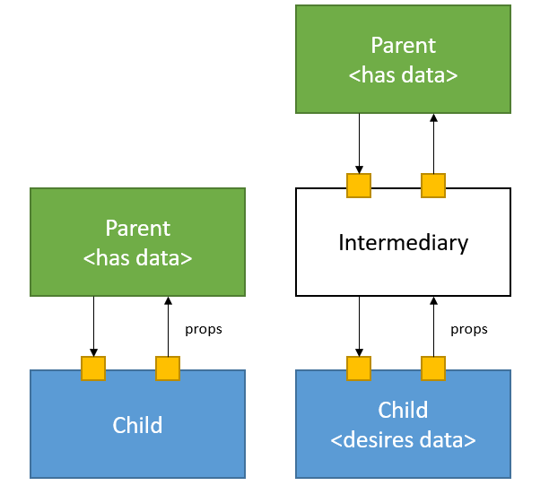
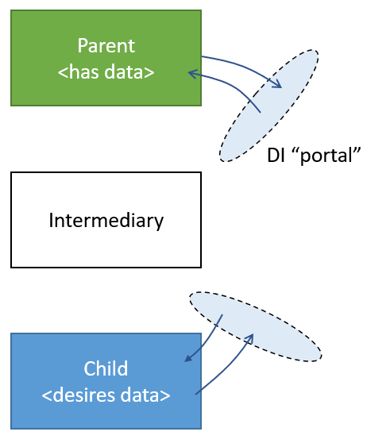
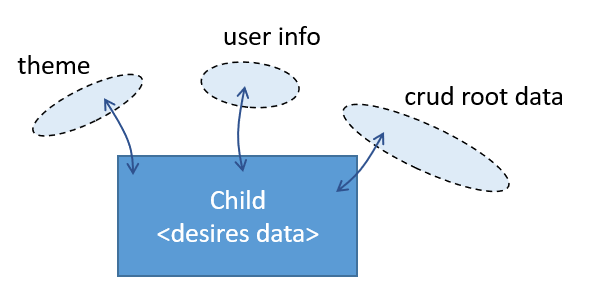

# Como os dados trafegam entre componentes?

A divisão da interface de usuário em componentes implica a necessidade de tráfego de informação entre estes. Existem 2 principais formas de tráfego de dados.

## Props



Props são portas de entrada (e saída) de dados de um componente.

O fluxo ocorre entre um componente e seu pai direto. Para que um componente acesse estado presente em um pai indireto (o pai do pai) via props, o dado tem que trafegar pelo componente intermediário. É como se fosse uma autoestrada passando no meio de uma cidade.

Abaixo exemplos em código representando a imagem acima:

React:
```tsx
// react -- Diagrama da esquerda

function ComponentWithState() {
  const [productInfo, setProductInfo] = useState('Product')
  return <Intermediary 
    productInfo={productInfo}
    productInfoChange={ev => setProductInfo(ev.target.value)}
  />
}

function Intermediary({ productInfo, productInfoChange }) {
  return <ChildDesiresData
    productInfo={productInfo}
    productInfoChange={productInfoChange}
  />
}

function ChildDesiresData({ productInfo, productInfoChange}) {
  return <input
    type="text"
    value={productInfo}
    onChange={productInfoChange}
  />
}
```

Angular:

```tsx
// angular -- diagrama da esquerda

@Component({
  selector: "component-with-state",
  template: `
    <intermediary [(productInfo)]="productInfo"></intermediary>
  `
})
export class ComponentWithState {
  productInfo = "Product";
}

@Component({
  selector: "intermediary",
  template: `
    <child-desires-data
      [productInfo]="productInfo"
      (productInfoChange)="productInfoChange.emit($event)"
    ></child-desires-data>
  `
})
export class Intermediary {
  @Input() productInfo = "";
  @Output() productInfoChange = new EventEmitter<string>();
}

@Component({
  selector: "child-desires-data",
  template: `
    <input
      type="text"
      [ngModel]="productInfo"
      (ngModelChange)="productInfoChange.emit($event)"
    />
  `
})
export class ChildDesiresData {
  @Input() productInfo: string;
  @Output() productInfoChange = new EventEmitter<string>();
}
```

## Injeção de dependências (ou estado contextual)



A comunicação entre o dono do estado e o consumidor é realizada por intermédio de um "portal de dados" (termo livre). Com isso, o dado não precisa trafegar em componentes intermediários.

  - O filho, consumidor, se registra para receber dados do "Portal";
  - O detentor do estado se registra para fornecer dados ao "Portal";


No React este "portal" é representado pelo tipo `Context`. O portal de entrada é o `context.Provider`, o portal de saída é o hook `useContext()` (ou o componente `context.Consumer`).

```tsx
const thePortal = createContext(null)

function ComponentWithState() {
  const [productInfo, setProductInfo] = useState('Product')
  const payload = {
    productInfo,
    productInfoChange: ev => setProductInfo(ev.target.value)
  }
  // entrada -->
  return <thePortal.Provider value={payload}>
    <Intermediary />
  </thePortal>;
}

function Intermediary() {
  return <div>
    <p>I am intermediary.</p>
    <ChildDesiresData/>
  </div>
}

function ChildDesiresData() {
  // saída <--
  const { productInfo, productInfoChange } = useContext(thePortal)
  return <input
    type="text"
    value={productInfo}
    onChange={productInfoChange}
  />
}
```

No Angular declaramos um "Serviço". O Serviço é uma classe (e uma peça de estado) que deve ser _plugada_ a um componente ou módulo via propriedade `providers`. O serviço é automaticamente instanciado e destruído junto com a entidade com a qual ele é plugado.

O consumo do serviço é feito pelo construtor da classe.

```ts
@Injectable()
class StateService {
  productInfo = 'Product';
}

@Component({
  selector: 'component-with-state',
  // entrada -->
  providers: [StateService],
  template: `
    <intermediary></intermediary>
  `,
})
export class ComponentWithState {}

@Component({
  selector: 'intermediary',
  template: `
    <child-desires-data></child-desires-data>
  `,
})
export class Intermediary {}

@Component({
  selector: 'child-desires-data',
  template: ` <input type="text" [(ngModel)]="state.productInfo" /> `,
})
export class ChildDesiresData {
  // saída <--
  constructor(public state: StateService) {}
}
```

# Quando usar props ou estado contextual (DI)?

O caso de uso comum para **props** são **componentes reutilizáveis**. Componentes que possuirão múltiplas instâncias no documento.

  - Componentes do sistema de design. Ex: Botão, Bloco, Select, Tabela...
  - Componentes que serão repetidos em um loop. Ex: Card de Pessoa, Linha de Tabela;

Se o componente não é reutilizado, é interessante acessar os dados via **DI**.

  - Digamos que temos um grande formulário de CRUD, que se colocado todo em um único componente, daria um arquivo com 3000 linhas;
  - De modo a separar as responsabilidades e organizar o desenvolvimento, esta grande formulário é dividido em muitos componentes menores, com poucas linhas, em múltiplos níveis de aninhamento;
  - Estes componentes filhos requisitam todos do mesmo componente "pai", que fica na raiz da estrutura. O pai guarda o estado do CRUD e controla suas modificações;
  - Um componente pode simultaneamente requisitar dados de diferentes "portais" DI.



# Onde mora o estado de uma aplicação

O estado é atrelado a componentes. Posiciona-se o estado em um componente pai ou filho dependendo da visibilidade desejada.

  - Uma peça de estado é geralmente visível (*) aos componentes filho, privada aos componentes pais.

Embora próprio guia do React recomende que você "mova estado para cima", em determinados casos você quer que ele fique "embaixo". Posiciona-se o estado no componente filho quando não interessa ao componente pai saber de sua existência. É tipo como se fosse uma propriedade _private_.

Exemplo:

```tsx
function Host() {
  const [value] = useState(2)
  // ...
  return <Autocomplete 
    value={value}
    onChange={handleChange}
    queryOptions={...}
  />
}

function Autocomplete(
  props: { value, onChange, queryOptions: (...) => Promise<Option[]> }
) {
  const [inputText, setInputText] = useState('')
  const [currentOptions, setCurrentOptions] = useState([] as Option[])
  // ...
  return <div>
    <InputText value={inputText} onChange={handleTextChange}/>
    <PopperList list={currentOptions}/>
  </div>
}
```

No exemplo acima

  - Não interessa ao pai de um componente de _Autocomplete_ saber do conteúdo que o usuário está digitando na caixa de texto (`inputText`, `currentOptions`). Interessa a ele apenas o id da opção selecionada;
  - Desta forma, o ID selecionado não é armazenado no estado do componente, mas entra via props; Já o valor da caixa de texto é armazenado como estado no autocomplete, tornando-se assim privado ao componente pai;

# Redux

É prática recomendada o uso do **Redux** para armazenar e trafegar dados contextuais (ao invés do `Context`).

**O que é, como funciona?**

A classe abaixo é um container de estado;

```tsx
class StateContainer {
  // estado
  addresses: Address[] = []
  // função
  addAddress(address: Address) { }
}

const instance = new StateContainer()
```

  - O Redux também é um container de estado como a classe acima; No exemplo abaixo temos um container redux com propridades similares;


```tsx
const slice = createSlice({
  name: 'main',
  initialState: {
    // estado
    adresses: [] as Address[]
  },
  reducers: {
    // função
    addAddress(state, payload: Address) { },
  },
});

const store = configureStore({
  reducer: slice.reducer,
});
```

  - O isolamento do estado e de sua manipulação **fora** dos componentes auxilia na organização de código e escrita de testes;

  - As funções do container do Redux (`addAddress`) são invocadas via _passagem de mensagens_;

```tsx
// plain class - direct call
instance.addAddress(address)
// redux store - message passing
store.dispatch(slice.actions.addAddress(address));
```

  - A característica passagem de mensagens permite a adição de `middlewares` a chamadas de função, (["chain of responsability"](https://refactoring.guru/design-patterns/chain-of-responsibility));
  - Funções do redux (reducers) não podem fazer mutações no estado anterior. Retorna-se um novo objeto imutavelmente criado a partir do estado anterior; Isso segue a necessidade do React de termos alterações de estado imutáveis (dentre outras razões);

## react-redux

É a biblioteca que integra o Redux ao React (duh);

Principais APIs:

  - `<Provider store={store}>`

Passa a _store_ redux no "portal de entrada" do `react-redux`. As demais APIs do `react-redux` exigem e consomem desse portal.

  - `useSelector(selector)`

Lê algo da store e passa para o componente. O parâmetro passado para a função é chamado de **seletor**.

```tsx
// exemplo correto
function Component() {
  const person = useSelector(storeState => storeState.card?.person)
  return <Person person={person} />
}

// uso errado
function Component() {
  const person = useSelector(storeState => storeState).card?.person
  return <Person person={person} />
}
```

O que muda do exemplo correto pro exemplo errado? Embora em ambos os casos os componentes recebam os dados desejados, no segundo caso o componente fará _re-render_ para _qualquer_ alteração da store. No primeiro caso, apenas quando o dado relevante for alterado.

A sacada aqui então é que o `useSelector()` permite melhorar a performance da aplicação reduzindo renders desnecessários.

Note que se meramente usássemos a API `Context` para trazer dados, como foi feito no exemplo lé em cima, teríamos um problema similar ao do "uso errado": Todos os consumidores do contexto dariam re-render para qualquer alteração do valor:

```tsx
// exemplo anterior...
const thePortal = createContext(null)

function ComponentWithState() {
  const [productInfo, setProductInfo] = useState('Product')
  const payload = {
    productInfo,
    productInfoChange: ev => setProductInfo(ev.target.value)
  }
  // entrada -->
  return <thePortal.Provider value={payload}>
    <Intermediary />
  </thePortal>;
}
```

O uso de `Context` sozinho não é performático, teríamos que implementar um mecanismo de seletores para torná-lo mais eficiente. O `react-redux` já trás isso.

  - `useDispatch()`

As funções do nosso container de estado são chamadas pelo `useDispatch`.

```tsx
function Component() {
  const dispatch = useDispatch()
  const increment = useCallback(() => {
    dispatch(incrementActtion())
  }, [])
  return <button onClick={increment}>
}
```

## reselect

O `reselect` é utilizado para trabalharmos com "dados derivados".

```tsx
import { createSelector, useSelector } from '@reduxjs/toolkit'

const selectPerson = state => state.person;

function calculateHash(person) {
  // some complex calc...
}

const selectPersonHash = createSelector(
  [selectPerson],
  person => calculateHash(person)
)

function Component() {
  const personHash = useSelector(selectPersonHash)
}
```

No exemplo acima a função `calculateHash` é computacionalmente intensiva.

Quando `Component` renderiza, o `selectPersonHash` retorna uma versão memoizada do hash. O hash só é recalculado quando `person` muda.