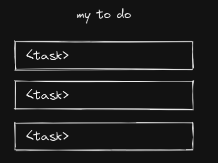

# React daily ramblings: Encapsulated list items

So this is something that should be simple but actually hit me for a while yesterday.

Let's say I want to create a To Do App. Or anything else with a list.



Since we have a list, the task list data would be a state stored in a parent component, and then spread to the children. Something like this:

```tsx
function Root() {
  const [tasks, setTasks] = useState([INITIAL_TASK])

  return <main>
    <h1>my to do</h1>
    <ul>
      {tasks.map(task => (<TaskView value={task} setValue={...}/>))}
    </ul>
  </main>
}
```

I have two main goals here:

- `<TaskView />` must be properly encapsulated. It should not care about WHERE it is put in the application. Thus, it should not know about its index in the array;
- `<TaskView />` will me `memo()`'d, which means its props should not change if its contents won't.

## Approach 1: Setter callback

We write `TaskView` like this:

(PS: code in this article not tested or linted)

```tsx
const TaskView = memo((
  { value, setValue }:
  { value: Task, setValue: (cb: (arg: (old: Task) => Task) => void }
) => {
  const handleChangeName = useCallback((event) => {
    const newName = event.target.value
    setValue(old => ({ ...old, name: newName }))
  }, [setValue])
  return ...
})
```

This is properly encapsulated but brings some challenges when writing the consumer.

```tsx
function Root() {
  const [tasks, setTasks] = useState([INITIAL_TASK])

  const setTaskAtIndex = useCallback((value: Task, index: number) => {
    setTasks(previous => {
      // ...
    })
  }, [])

  return <main>
    <h1>my to do</h1>
    <ul>
      {tasks.map((task, idx) => {
        const setValue = callback => {
          const newValue = callback(task)
          setTaskAtIndex(newValue, idx)
        }
        return <TaskView value={task} setValue={setValue}/>
      })}
    </ul>
  </main>
}
```

So the problem here is that `setValue` will always have a new reference on every render, "rendering" the `memo()` useless. Since it resides inside a loop with dynamic size, I can't apply `useCallback` on it.

A naive approach would be adding an extra prop `index` to the `TaskView`, but this would be a hack as encapsulation would be broken.

I've tackled this by creating an "adapter component", so that `useCallback` could be used. Now `TaskView` should only re-render when its data changes.

```tsx
function TaskViewAdapter(props: {
  value: Task,
  setValueAtIndex: (value: Task, index: number) => void ,
  index: number
}) {
  const setValue = useCallback((callback) => {
    const newValue = callback(value)
    setValueAtIndex(newValue, index)
  }, [value, setValueAtIndex, index])
  return <TaskView value={props.value} setValue={setValue} />
}
```

## What is different with HTML Events?

An old and common approach on handling lists is the use of tags.

```tsx
function Main() {
  const handleClick = useCallback((ev) => {
    console.log('index', ev.target.dataset.index)
  }, [])
  return <ul>
    <li><button data-index="1" onClick={handleClick}>Button 1</button></li>
    <li><button data-index="2" onClick={handleClick}>Button 2</button></li>
  </ul>
}
```

What has changed here? Differently from our `setValue` callback, the HTML event brings **context** along with the data. It brings the whole element instead of simply the value;

This means the parent can attach data to the element, end then read that data back when handling the event. And the internal implementation of `<button>` still doesn't need to know that what extra info has the parent attached.

We can attempt to replicate that by, instead of simply emitting data, emitting an event-ish which has extra contextual data about the component. Since custom event emitting is not inside any React "standard", we'd have to pinpoint a standard event format for the particular project.

```tsx
const event = createEvent({
  component: getSelfRef(),
  data,
})
onChange(event)
```

Also, (when using Hook Components) there is no way to get the current component reference without involving the creation of a wrapper "Adapter" component. So in the end we fall again into the same case of needing an Adapter.