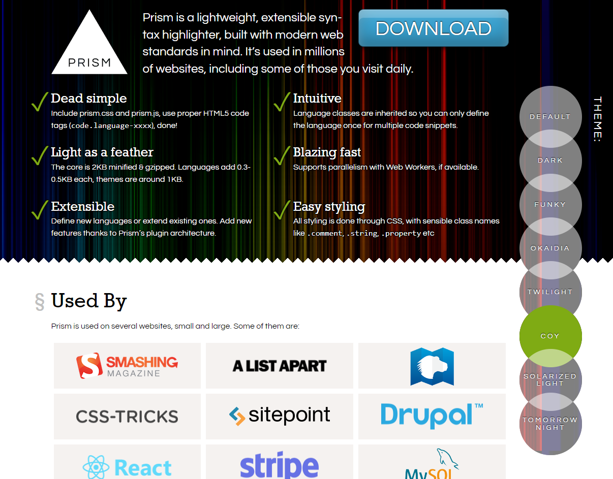

# Notas do blog pessoal

## Requisitos
- Escrever textos em markdown
- Preferencialmente usando arquivos, sobre um controle de versão
- Facilmente inserir imagens
- Publicar no commit

### Requisitos mais avançados
 - Suportar uma estrutura já existente de textos escritos
 - Suportar wikilinks
 - Exibir backlinks
 - Permitir leitura também pelo github
 - Syntax highlighting
 - Publicação e sincronização em plataformas externas via API
 - Editar pelo celular

Em geral acho o github muito bonito para leitura. Porém se o texto incluir wikilinks, ele precisa de processamento pra poder ser diretamente lido pelo Github. Se o site ficar bonito, então o Github não é lá importante.

Pra edição de arquivos .md temos Obsidian, VSCode, Typora... Cada um deles tem seus quirks e bugs em relação a edição de blocos de código, inserção de imagens e navegação.

A algum tempo eu já vinha acumulando alguns artigos (blogs ou peças maiores) em .md para talvez num futuro publicar em um site local. Alguns foram publicados no dev.to e no gitbook. Ao publicar no dev.to e ficar editando lá, o artigo acaba dessincronizando.

# Implementação

A idéia é converter o markdown em HTML usando um gerador estático. Vamos de next.js pela familiaridade. Gera páginas estáticas e é flexível e bem suportado.

No lado do CSS, vamos de Chakra. É algo com que ainda estou me familiarizando mas em geral é um software com que "fui com a cara" [[Atributos de um software que me fazem ir com a sua cara | (adiciona wikilink pra futuramente escrever o que me faz ir com a cara de um software)]].

## Estrutura pré-existente

- Pasta `md` dentro do `wkrueger.github.io`. Cada post gera uma subpasta com ano, mês e slug. A subpasta vai possuir um arquivo `.md` e pode possuir imagens e rascunhos;
- Nome da pasta: `2021-04-slug-do-artigo`;
- Além da estrutura de posts de blog, isso talvez possa expandir pra outras pastas com conjuntos de documentos;
- Além do conteúdo no `github.io`, tenho outras coisas postadas em outros repositórios de GitBook, que mais adiante poderiam ser integradas;

## Montando a listagem de artigos

- Escrever código para varrer a pasta de markdowns pra gerar uma lista com informações dos artigos;
- Este é um código de backend, portanto ele mora dentro de um `getStaticProps()`;
  - Tem que tem um cuidado especial ao importar APIs de servidor;
- O nome da pasta não é suficiente pra termos um nome de artigo (apenas um slug); Alternativas:
  1. Implementar o _front-matter_ e editar os arquivos markdown existentes;
  2. Rodar uma heurística que lê a primeira tag H1 e a marca como título;
- Seguimos na alternativa 2, por hora. Tentei ler apenas o início de cada arquivo, mas na verdade isso não vai poupar quase nada de processamento;

## Montando os primeiros estilos

- Sigo como exemplo de inspiração o [blog do swyx](https://www.swyx.io/js-third-age);
- Implemento o [Dark Mode do Chakra](https://chakra-ui.com/docs/styled-system/color-mode), o que é relativamente direto;
	- O tema do Dark Mode do Chakra é convencional e bonito. Adiciono uns acentos de laranja, inspirado no swyx. Por sorte o laranja também funcionou no modo claro;
- Sofro um pouco pra entender como acessar a [paleta de cores](https://chakra-ui.com/docs/styled-system/theme) do tema base; Na verdade até agora não está muito claro;
   - As cores podem ser acessadas via variáveis CSS (dá pra ver no inspetor) ou via _semantic tokens_. O problema é que na documentação não explica muito bem _quais_ variáveis estão disponíveis no tema base;
 - Quando eu uso diretamente uma cor da paleta do Chakra, esta não se adapta entre os modos claro e escuro;
   - Me lembro de no Material-UI ter um esquema de passar uma função no CSS para acessar o modo de cor, mas no Chakra não encontrei nada disso;
   - A forma que encontrei foi definir um [semantic token](https://chakra-ui.com/docs/styled-system/semantic-tokens) com as condições "_dark" e "_light";
 - O _semantic token_ é então interpolado em qualquer definição de estilo. Ex:

```tsx
const customTheme = extendTheme({
  semanticTokens: {
    colors: {
      myColor: {
        _dark: 'rgba(0,0,0,0.2)',
        _light: 'rgba(255,255,255,0.2)',
      },
    },
  },
})

return <Box sx={{ color: 'myColor' }}></Box>
```

## Montando a página de detalhe de artigo

 - A partir de um _slug_, tenho que selecionar um arquivo markdown e processá-lo;
 - Das libs de markdown, o MDX parece o que tem melhor manutenção, mesmo que injetar componentes React dentro do markdown no momento não seja um requisito;
 - Utilizo a lib `next-mdx-remote`, a qual serializa dados de um documento markdown no backend (dentro do `getStaticProps()`); Na doc do MDX na verdade foi recomendada outra lib, mas esta funcionou bem; Uso simples e funciona;

## Estilizando documentos

  - A lib de markdown se responsabiliza em converter markdown em HTML, mas não em formatá-lo;
  - Sigo o guia na documentação do MDX pra adicionar _syntax highlighting_.
	  - Escolho a opção "prism" (fujo da pre-histórica _highlight.js_);
	  - O site do _prism_ é MUITO FEIO. Tem um seletor de temas na lateral que só reflete em blocos de exemplo que tem que rolar a página pra poder ver. Um terror.




- Cato no google o CSS com o tema _Shades of Purple_ para o _prism_. Eu já lembrava desse tema no VS Code e convenientemente ele tem acentos em laranja;
- Edito tamanho de fonte e cor de fundo;
- Os vários elementos diferentes que podem ser gerados têm que ser estilizados manualmente. Mas até que não é tanta coisa:
  - p, h1, h2, h3, blockquote, ul, ol, li, pre
  - Isso tudo usando o emotion, que é uma delicinha;


## Lidando com imagens

  - É necessário que as imagens estejam acessíveis a partir da pasta `public`, para que elas entrem no build do next.js;
  - Inicialmente pensei em verificar se tinha como fazer o webpack embutí-las no build. Mas pensando melhor, pro webpack importar imagens, elas têm que ser estáticas (o que não é o caso);
  - Acabei fechando com uma gambiarra imensa:
    - O MDX permite que você dê override nos elementos HTML com componentes React;
    - Dei override no componente de imagem, e quando o render roda no servidor, a imagem é copiada da pasta de origem pra pasta `public`. Por fim, esta paste de imagens no `public` é ignorada do git;
    - Não necessariamente precisaria copiar, um _symlink_ também funcionaria. Mas estou rodando o projeto no Windows e aparentemente no Windows o symlink precisa de permissão administrador;

## Build manual

  - `yarn build` (invoca `next build`)
  - `yarn next export` (copia tudo para uma pasta `out`)
  - Mover a pasta `website/out` para `./docs`
    - O GitHub pages aceita que o site esteja ou na raiz ou na pasta _docs_;
    - Isto é configurado nas configurações do projeto, aba "Pages";
  - Ao acessar o site, alguns assets que ficavam na pasta `_next` não foram encontrados; Aparentemente é algo do Github que faz ignorar pastas começando com `_` da build;
  - Confirmo a teoria, encontrando no Google um artigo instruindo a criar um arquivo `.jekyllignore` na pasta a ser servida (no caso, `docs`);
  - Funcionou!

## Wikilinks e referências inversas

TODO

## Build automática

  - Embora eu acredite que com alguma tentativa e erro eu possa criar um _Actions_ pra rodar o build do next em todo commit, quero sentar pra estudar com calma a doc do Github Actions; Ficará pra depois;
  - Uma interrogação é que o build terá que gerar um commit novo a partir da compilação do nextjs
