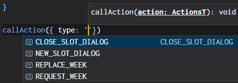
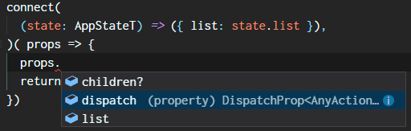
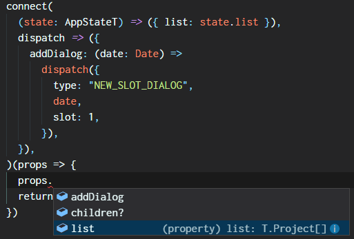
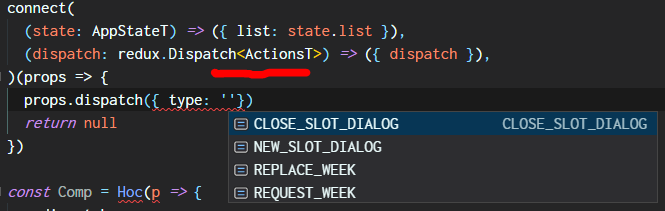
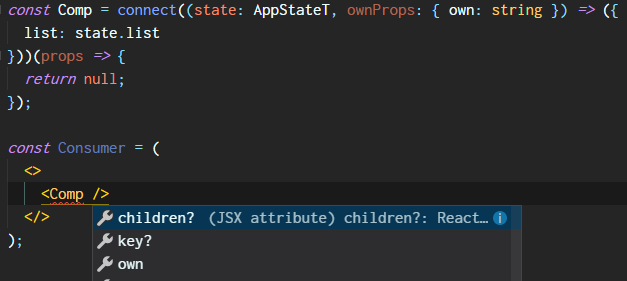
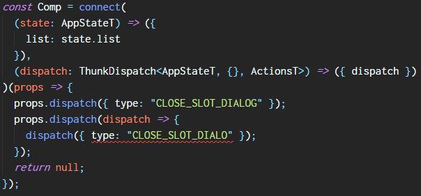
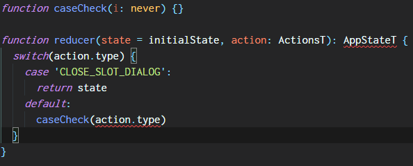

# Downhill with the react+redux+typescript train

> A somewhat basic journal from someone who has just jumped aboard the train.

So I decided myself to learn redux huh? Turned out to be quite a pain in the arse initially, but with some time and chewing I was able to get into something more... palatable.

During this saga I have written a couple of pieces of texts about opinions and pains, which are now sewed and enhanced into this article.

## The initial bets

### Action types

When listing the action types, I have ended up with the following format:

```typescript
export type Actions =
  | {
      type: "NEW_SLOT_DIALOG";
      date: Date;
      slot: number;
    }
  | {
      type: "CLOSE_SLOT_DIALOG";
    }
  | {
      type: "REQUEST_WEEK";
    }
  | {
      type: "REPLACE_WEEK";
      weekView: AppState["weekView"];
    };
```

This might seem really ugly for some, but has its reasoning:

- Tagged unions work fine on the type system overall;
- This is the most DRY approach I could find and avoids creating several additional reformats of the "type" string; (ex: `type NewSlotDialogActionType = {}`)
- I didn't initially bother writing action creators because _this_ was enough for me at the time:



### The initial state

```typescript
const initialState = {
  detail: undefined as
    | undefined
    | {
        state: "NEW" | "EDIT";
        project: T.Project;
        error?: { name: string; message: string };
      },
  list: [] as T.Project[],
  list_error: undefined as { name: string; message: string } | undefined,
  list_is_processing: undefined as undefined | true,
  remove_modal: undefined as undefined | { project: T.Project }
};

export type AppState = typeof initialState;
```

Now this is another kind of thing that I'm sure a lot of guys will pull a face, but it has its own beauty.

By writing like this I avoid having to write a `var` and an `interface` for the same thing. It's all in one place, less duplication! One downside is the inability of writing root optional keys: it has to be `undefined`.

### The connect hell

If you ever wrote redux+typescript you might already be aware Cthulhu is the one who writes type signatures for `connect` (and many other beloved HOCs). (Great work, Cthulhu.)

```typescript
const Container = connect<InputProps, OutputProps, {}, AppState>(
  //map state to props
  ({ foo, bar }) => ({ foo, bar }),
  //map dispatch to props
  dispatch => ({ dispatch })
)(Presentation);
```

Things get even hairier if you dare trying _recompose_. Brace yourself!

Some basics on how inference works at the moment:

- Either you pass all of the type parameters, either none. There's no middle ground;
- If you pass no type parameters, then you'll have to annotate some key variables and pray the inference gets it. Always aim for this case. (this is should be a typescript mantra: infer everything!)
- Writing arguments inline usually tends to be better for the inference. You might lose benefits if you write `mapStateToProps` in another place.

Specifically for the `connect` case and the typings from the current date, the following applies:

- `state` type has to be annotated in, `InputProps` and `OutputProps` are inferred.





- `dispatch` comes with a `redux.Dispatch<AnyAction>` default. This is bad, since `AnyAction` discards all those cool types I have wrote before. In order to make use of detailed action types, `dispatch` must be type annotated.



- `ownProps` also has some inference points. One is the second argument of the `mapStateToProps` function. You'll have to explicitly _return_ them in `mapStateToProps` otherwise they won't show up in the render function.



- **Other dispatch signatures:** The dispatch function may accept different types of inputs depending on the middleware installed on the context store, so the type you annotate there has to adapt to that. For instance, `redux-thunk` now exports its own Dispatcher type, which works fine.

  

Now, writing `ThunkDispatch<AppStateT, {}, ActionsT>` on a dozen of components (and having to import Actions and State everywhere) might start to become a bit overwhelming. One suggestion to amend that would be declaring those common types (the dispatcher, actions and state) as global types by using something like `declare global {}`.

### The reducer

Nothing special here. I'm 100% not a fan of squeezing dozens of functions into a switch-case, but we will come to that later.



The image above brings 2 ways of checking missing _cases_:

- Not returning anything in the end (brings `AppState <! undefined`); Unfortunately you can't do that since the reducer may also receive other unknown external action types;
- Call this `caseCheck` function in the end;

## Chapter 2: Cooking something simpler

After some weeks of redux, I got there with some obvious statements:

- The whole redux thing is mostly an abstraction for calling functions:

  - Instead of calling a function, you dispatch a message;
  - This allows a clearer implementation of a middleware pattern, which allows neat... _things_; Oh, subscriptions too.
  - It's nice to know upfront which functions don't produce side effects;

- The pains of the "default architecture" (which is not part of redux!):

  - Instead of declaring a function in one place, you split its signature and implementation body into 2 files;
  - Yeah, then you crank all signatures into one file, all implementations into a switch-case! LOLOLOL;
  - Things get significantly more complex to write when using TS, since many once invisible couplings now arise to the surface and have to be included in the code (ex: `connect` relies on `State` and `Actions`); This not to mention the other usual TS ecosystem issues;

### Sewing the functions back

A conventional _switch-case_ (without multiple falls or sort) can be represented with a dictionary:

```typescript
function switchCase(theCase) {
  switch (theCase) {
    case "CASE1":
      return handleCase1();
    case "CASE2":
      return handleCase2();
  }
  throw Error("Hey!");
}

function dict(theCase) {
  const theDict = {
    CASE1: handleCase1(),
    CASE2: handleCase2()
  };
  const handlerFound = theDict[theCase];
  if (handlerFound) return handlerFound();
  throw Error("Hey!");
}
```

Where are we getting?

- Actions (their payload and their implementation) can be sewed back to their old function nature through the use of a dictionary (aka. object);
- This single source (the object) can generate both:
  - The reducer function;
  - All of the underlying action types, with a bit of type algebra;

```typescript
const meatball = wrapFunctions(
  initialState,
  {
    article_edit : (state, act: { articleId: number, content: string }) => ({
      ...state,
      editArticleDialog : act
    }),
    feed_append : (state, act: { articles: NewsArticle[] }) => ({
      ...state,
      newsFeed : [...state.newsFeed, ...act.articles]
    })
  }
)

//meatball bundles it all
meatball.reducer
meatball.creators.article_edit({ articleId: 2, content: 'content' })
redux.Dispatch<typeof meatball.actionTypes>
```

This approach has been exported into [yet another javascript library](https://github.com/wkrueger/redutser), just in case you are curious. I have also baked in a couple of another useful stuff. I've also later found out [rematch](https://github.com/rematch/rematch), which seems quite similar and straightforward (havent tested it enough myself).

### Getting aboard the dict train

"So, all this reducer talk seems nice, but seriously, when do I get to the REAL thing? I'm talkin 'bout real async code!"

Rematch suggests the grouping of async dispatcheables into a dict they call `effects`. I liek it. So we put the _wheel_ code into the effects.

```typescript
export const effects = createEffects(meatball)({
  reloadRules: () => async dispatch => {
    let rules = await Api.rule.list();
    dispatch(meatball.creators.ruleList_replace({ rules }));
  },
  removeRule: (id: number) => async dispatch => {
    await Api.rule.remove(id);
    dispatch(meatball.creators.removeRule({ id }));
  }
});
```

Now this just uses thunks, but even typing thunks can get cumbersome. `createEffects` uses tricks similar to those we used before in order to avoid writing repeat type annotations:

```typescript
export function createEffects<MB extends Meatball>(meatball: MB) {
  return function<
    FX extends {
      [k: string]: (
        ...i: any[]
      ) => ThunkDispatch<MB["actionTypes"], MB["initialState"]>;
    }
  >(fx: FX) {
    return fx;
  };
}
```

- A no-op runtime-wise (just returns the unmodified input);
- Uses our previously created "meatball", which already had Actions and State baked in;
- Type-check the incoming object for a "dict of thunks", without erasing its type;
- Since the object has an expected incoming type, we don't have to type-annotate the `dispatch` function.

## Conclusion

Nothing to conclude, guys, still a long way to go! I just wish I had stumbled less in the way ~cough~. Thanks!
